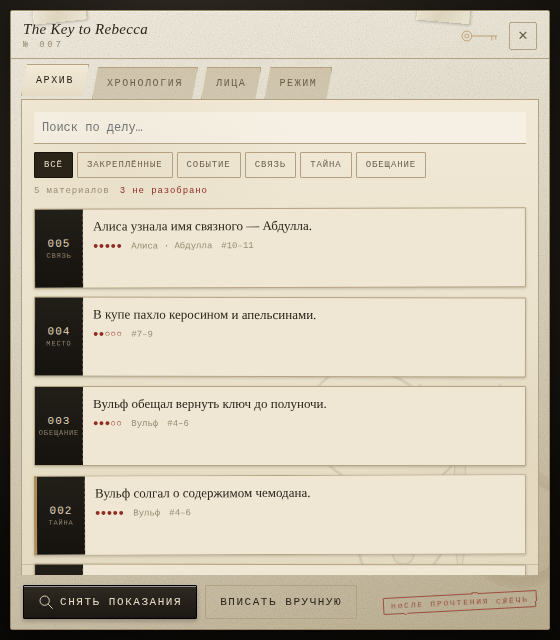
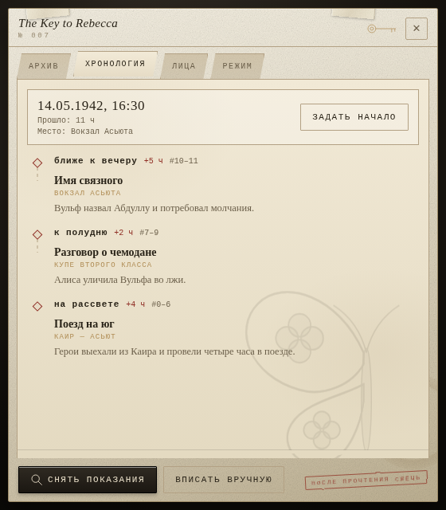
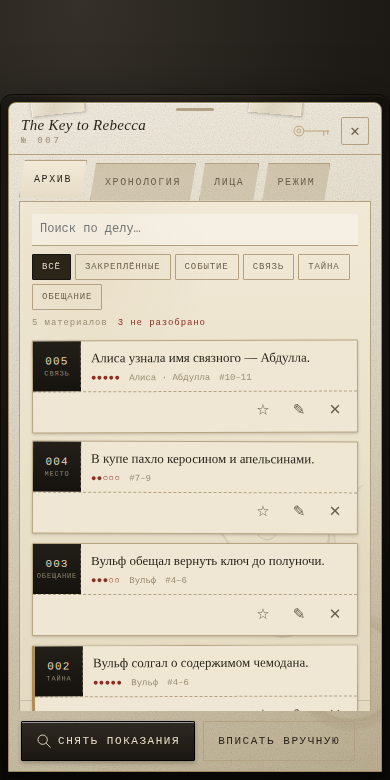

# Dossier — память сцен и хронология

Расширение для SillyTavern. Читает диалог порциями,
вытаскивает из него произошедшее, ведёт внутриигровые часы и возвращает
накопленное обратно в промпт. Оформлено как архивное дело следователя:
папка лежит поверх чата, её можно таскать, по нажатию раскрывается досье.



<p align="center">
  
  
</p>

## Что делает

**Память сцен.** Каждые N сообщений неразобранный хвост чата уходит модели
с просьбой выписать только то, что действительно случилось. Ответ приходит
в JSON: короткие факты, участники, важность от 1 до 5, тип (событие, тайна,
обещание, связь, место, предмет). Похожие формулировки отсеиваются, поэтому
одно и то же событие не попадает в дело дважды.

**Хронология.** Вместе с фактами модель сообщает, сколько времени прошло
внутри фрагмента и как оно названо в тексте. Расширение копит минуты и
показывает шкалу эпизодов. Если задать начальную дату — считает календарь
(«14.05.1942, 16:30»); если мир без календаря — ведёт счёт «прошло 11 ч»
и запоминает формулировки вроде «ближе к вечеру».

Часы пересобираются из эпизодов по номерам сообщений, а не по порядку
разбора, поэтому дозаписанный задним числом кусок истории не ломает счётчик.

**Возврат в промпт.** Отобранные факты и текущее время вставляются в чат
системной заметкой на заданной глубине. Отбор: сначала закреплённое, затем
важное, затем свежее; в промпт отдаётся в хронологическом порядке.

## Экономия токенов

Главная настройка — **«Источник разбора»** на вкладке «Режим».

- **Основной API чата.** Запрос идёт через `generateRaw`: в модель уходит
  только наш фрагмент, без истории чата и карточки персонажа. Это уже
  сильно дешевле обычной генерации.
- **Отдельный профиль подключения.** Разбор уводится на другую модель
  (например, дешёвую) через Connection Profiles. Основной контекст не
  тратится вообще. Профиль создаётся в штатном расширении
  «Connection Profiles»; здесь он просто выбирается из списка.

Если профиль выбран, но менеджер профилей отключён, расширение молча
откатывается на основной API, а не падает.

Прочее, что режет расход: `Сообщений за один разбор`, `Символов из сообщения`
(обрезка длинных реплик), `Минимальная важность факта` (мелочь не хранится),
`Лимит ответа`.

При подключении к чату с длинной историей расширение **не** бросается
разбирать её целиком. История помечается пропущенной, а в «Архиве»
появляется кнопка разбора — решение за вами.

## Установка

### Через SillyTavern

«Extensions» → «Install extension» → вставить ссылку на репозиторий:

```
https://github.com/jellysilly/ST-Dossier
```

SillyTavern склонирует репозиторий сам. Имя папки он берёт из имени
репозитория.

В манифесте стоит `"auto_update": true` — при запуске SillyTavern будет
подтягивать новые коммиты. Если это не нужно, поставьте `false`.

### Вручную

Папку целиком (с `manifest.json` внутри) положить в одно из мест:

- только для себя: `data/<ваш-пользователь>/extensions/SillyTavern-Dossier/`
  (обычно `data/default-user/extensions/SillyTavern-Dossier/`);
- для всех пользователей: `public/scripts/extensions/third-party/SillyTavern-Dossier/`.

Перезапустить SillyTavern и обновить страницу. Расширение появится в меню
«Extensions», а поверх чата — папка.

## Управление

Папка перетаскивается мышью и пальцем, положение запоминается. Нажатие
раскрывает дело. На узком экране дело открывается листом снизу на весь экран.

Вкладки: **Архив** (факты, поиск, фильтры, закрепление, правка, удаление),
**Хронология** (часы и шкала эпизодов), **Лица** (фигуранты и что о них
известно), **Режим** (настройки, выгрузка и загрузка дела, «Сжечь дело»).

Команды: `/dossier` — открыть или закрыть, `/dossier-open` — открыть,
`/dossier-scan` — разобрать прямо сейчас,
`/dossier-fact <текст>` — вписать факт вручную.

## Где что лежит

Дело хранится в метаданных чата, поэтому у каждого чата свой архив, и он
уезжает вместе с экспортом чата. Настройки — общие, в настройках расширений.

```
manifest.json      описание расширения для SillyTavern
index.js           точка входа: события, автоматика, команды, панель в меню
style.css          оформление
preview.html       песочница оформления: открывается без SillyTavern
docs/              скриншоты для README
src/i18n.js        строки (ru/en, язык берётся из SillyTavern)
src/settings.js    общие настройки и значения по умолчанию
src/store.js       дело в метаданных чата
src/llm.js         обращение к модели: основной API или профиль, разбор JSON
src/prompts.js     тексты запросов к модели-архивариусу
src/extractor.js   разбор, отсев дублей, слияние, часы
src/timeline.js    внутриигровое время и его форматирование
src/inject.js      возврат памяти в промпт
src/ui.js          папка, раскрытие, перелистывание, диалоги
src/views.js       отрисовка страниц
src/assets.js      рисованные элементы (бабочка, ключ, печать)
src/drag.js        перетаскивание указателем (мышь и палец одинаково)
```

## Правка оформления

`preview.html` открывается в браузере без SillyTavern и показывает дело
с демонстрационными данными — удобно подгонять стили, не перезапуская
таверну. Нужен любой локальный сервер, например:

```
python3 -m http.server 8777
```

затем открыть `http://localhost:8777/preview.html`.

## Что учтено

Анимации отключаются настройкой и системным «уменьшить движение».
Текст фактов экранируется, разметка из ответа модели не исполняется.
Ответ модели разбирается терпимо: снимаются ```-ограждения, отрезается
болтовня вокруг JSON, чинятся висячие запятые; если не вышло — одна
повторная попытка с более жёсткой формулировкой, потом честная ошибка.
Свайпы и удаления сообщений сдвигают границу разобранного назад.
